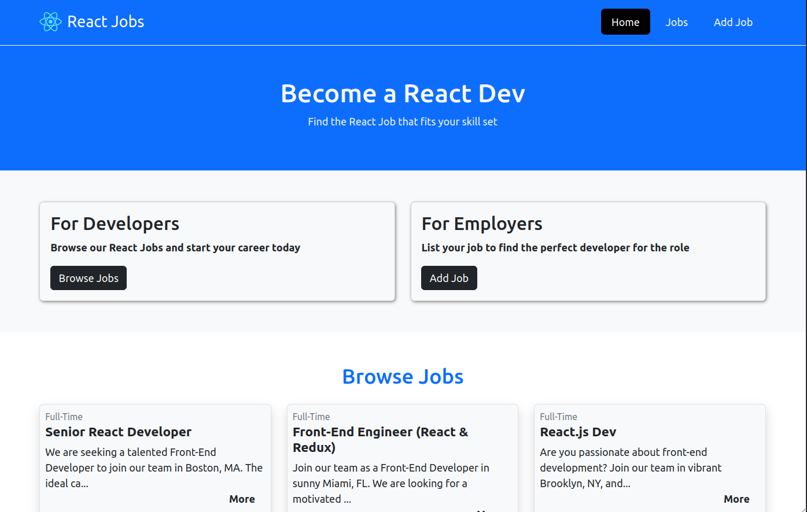
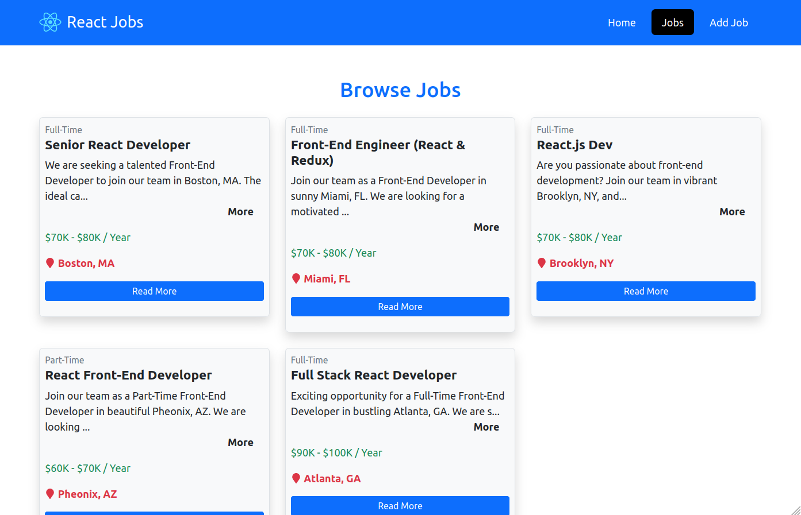
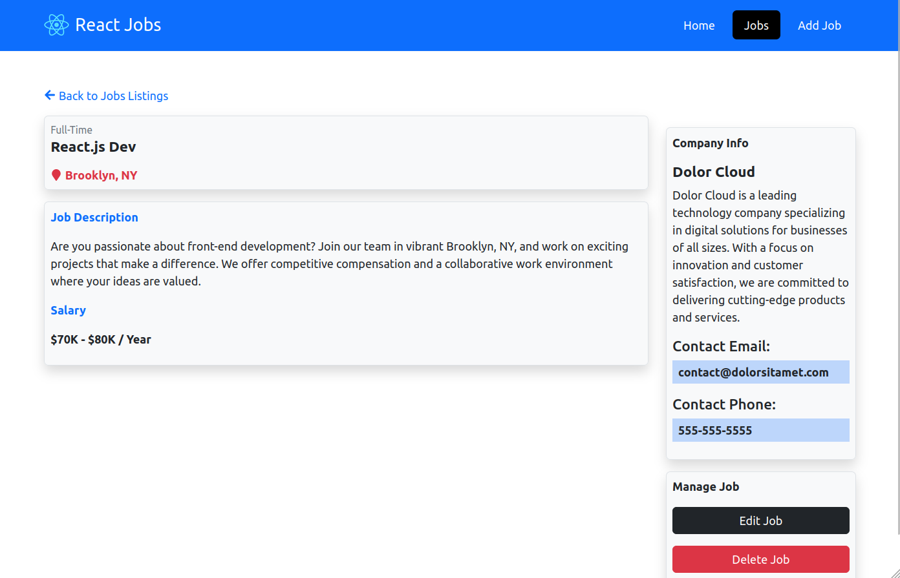
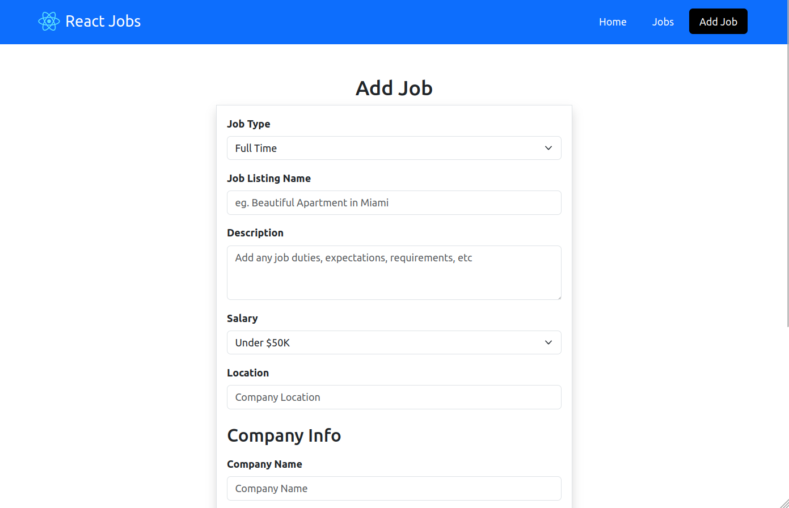
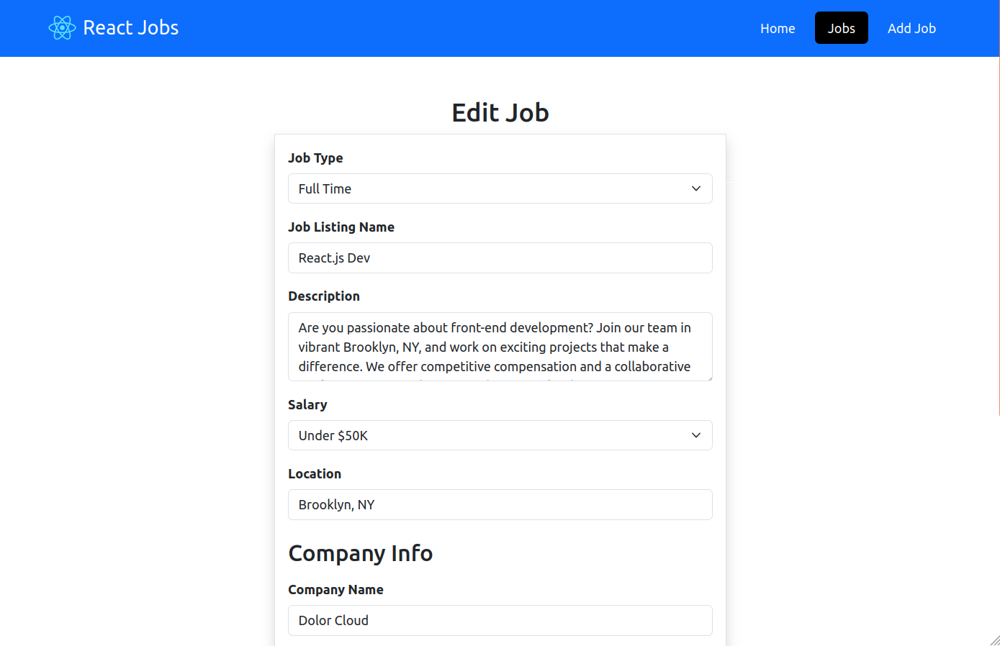

# Jobs App

Created with ReactJs and Bootstrap and JSON server as backend, in which you can create, list, delete and edit jobs listings; 

<table>
<tr>
<td width="50%">

</td>
<td width="50%">

</td>
</tr>
<tr>
<td width="50%">

</td>
<td width="50%">

</td>
</tr>
<tr>
<td width="50%">

</td>
<td width="50%">

</td>
</tr>
</table>